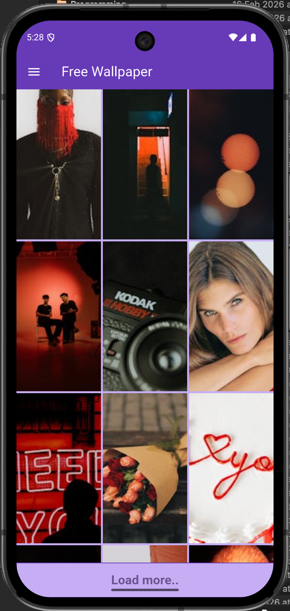
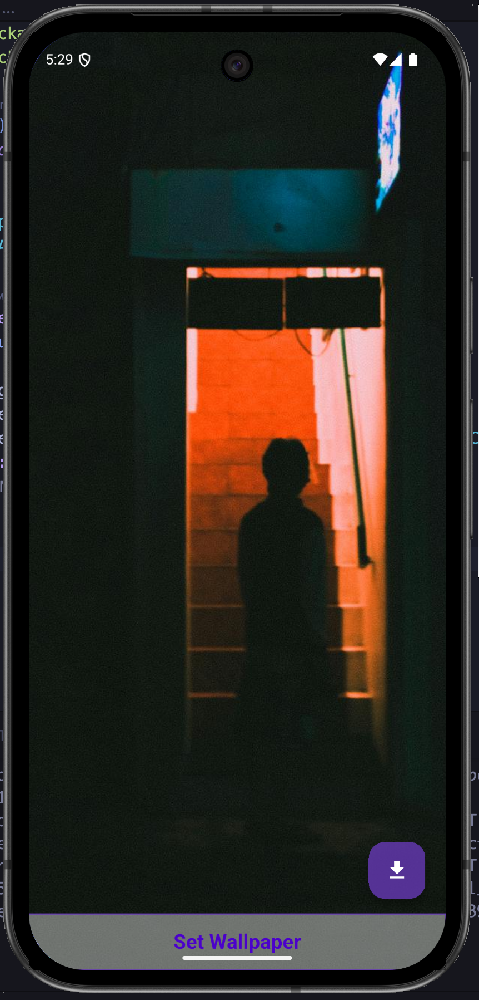
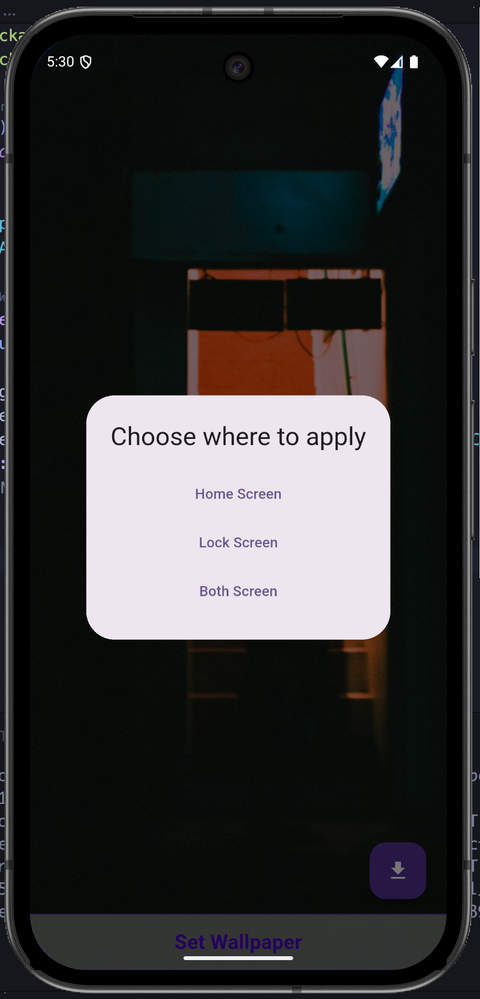

# Wallpaper App (Flutter)

A simple Flutter-based wallpaper application that fetches high-quality images using the **Pexels API** and allows users to set them as **Home Screen**, **Lock Screen**, or **Both**.

This is not some over-engineered app. It does one job and does it cleanly.

---

## 📱 Features

- Browse high-quality wallpapers from Pexels
- Grid-based modern UI
- Full-screen wallpaper preview
- Set wallpaper for:
  - Home Screen
  - Lock Screen
  - Both Screens
- Download wallpapers locally
- Load more wallpapers (pagination support)

---

## 🛠 Tech Stack

- **Flutter**
- **Dart**
- **Pexels REST API**
- HTTP package
- Android native wallpaper manager integration

---

## 📸 Screenshots

  
  
  

